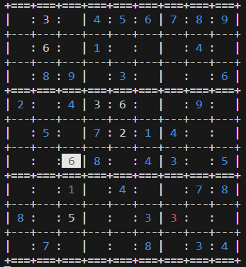
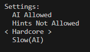

# Sudoku

Terminal sudoku with solver ai  

### How to run?

Run `sudoku.exe` or compile using `make`

### TODO

- make better tutorial
- Remove unncessary code and use structures for readability  

## Note: Only compiles on Windows 

### Game Images

Game board:

Different Settings Available

